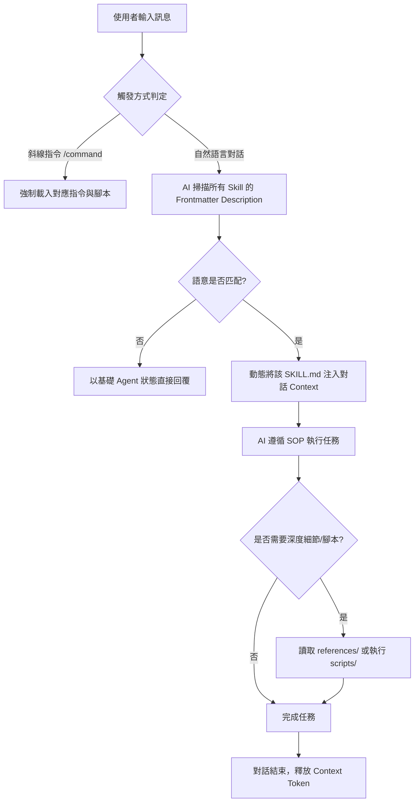

+++
title = '【AI工具】Agent Skills (一) - 核心架構、生命週期與跨工具實戰'
date = '2026-06-28'
slug = 'rules-bridge-create-and-sync-ai-skills'
description = '深入解析 AI Agent Skills 的核心概念、檔案結構（SKILL.md、scripts、references）、底層生命週期與市集管理，並透過 rules-bridge 一鍵同步至 GitHub Copilot、Antigravity、Cursor 等工具。'
categories = ['AI工具', '開發工具']
tags = ['rules-bridge', 'Antigravity', 'Cursor', 'GitHub Copilot', 'AI-Skills', 'Kiro']
keywords = ['AI Skills', 'Agent Skills', 'rules-bridge', 'Antigravity', 'Github Copilot CLI', 'AI 代理人']
image = '/image/rules_bridge_cover.png'
+++

## 前言

在現代軟體開發流程中，我們越來越依賴 AI 助手（如 GitHub Copilot、Antigravity、Cursor、Claude Code）來處理重複性高、但又必須嚴格符合專案規範的工作，例如：

- 產生符合團隊規範的 Conventional Git Commit
- 建立格式一致的技術部落格文章或 API 規格書
- 套用特定的架構模式、Coding Style 或自動化測試

然而，過去我們往往將這些規範寫在一長串的 Prompt 中，導致每次新開對話都要重新貼上，既不穩定也無法在團隊中版本化共享。

這正是 **Agent Skills（代理人技能）** 出現的原因！

透過 Skills，我們可以把「如何完成一項任務」封裝成可版本化、可分發、可重複利用的模組。這篇文章將帶你完整了解 Agent Skills 的核心概念、目錄結構、底層生命週期，並示範如何從零建立客製化 Skill，以及透過 `rules-bridge` 一鍵同步到各大 AI 工具！

---

## 一、什麼是 Agent Skill？（核心概念）

如果說 **Prompt** 是你每次對話給 AI 的「臨時口頭交代」，那麼 **Agent Skill** 就是為 AI 助手安裝的**「專業外掛能力包」**。

它的本質是：**「專業領域知識（Domain Knowledge）+ 標準作業程序（SOP）+ 可執行工具鏈（Toolchain）」** 的完整封裝。

### 1. Prompt vs Instructions vs Skills 演進比較

| 維度 | Prompt（提示詞） | Instructions（指示文件） | Agent Skills（代理人技能） |
| :--- | :--- | :--- | :--- |
| **存在形式** | 即時對話輸入 | 全域常駐的 Markdown 文件 | 模組化目錄（SOP + 腳本 + 參考資料） |
| **觸發方式** | 使用者手動輸入 | 每次對話預設載入 System Prompt | **語意自動匹配（Semantic）** 或 **斜線指令** |
| **Token 消耗** | 每次手動占用 | 全程占用 Context 空間 | **隨取隨用（On-Demand）**，用完即移出 |
| **功能能力** | 僅能生成文字 | 僅能約束回答風格 | **能執行實體腳本、操作終端機與工具** |
| **版本維護** | 難以管理 | 專案級版本控制 | **標準化模組，可跨專案/團隊共享** |

### 2. 為什麼 Skills 正在取代傳統 Prompt？

- **可版本化（Versionable）**：與程式碼一樣納入 Git 進行版控與 Code Review。
- **可組合（Composable）**：不同任務可自由疊加多個技能（例如：寫作技能 + Git 提交技能）。
- **可動態觸發（Dynamic）**：AI 能透過自然語言語意判斷何時調用，不需人工手動複製貼上。
- **可執行自動化（Executable）**：能直接串接 Shell、Python 等實體腳本，讓 AI 從「只動嘴」進化為「能動手」。

---

## 二、Agent Skill 的解剖結構（Anatomy of a Skill）

一個標準且結構健壯的 Agent Skill 是一個獨立的資料夾，內部通常包含以下幾個核心組成元件：

```text
your-skill-name/
├── SKILL.md                 # 核心：中繼資料宣告與 SOP 規範指引（必填）
├── references/              # 深度文件：規格書、API 文件、領域知識庫（選用）
├── examples/ 或 resources/  # 範本與資產：輸入輸出範本、靜態資源（選用）
├── scripts/                 # 工具鏈：自動化執行的 Shell/Python/Node 腳本（選用）
└── commands/                # 指令：斜線指令 (/command) 定義檔（選用）
```

### 1. `SKILL.md`（核心）
每個 Skill 的入口點與心臟。最上方包含 **YAML Frontmatter**（定義技能名稱與描述），下方則是給 AI 閱讀的具體執行規範與 SOP：
- **`name`**：技能識別名稱（如 `add-post`、`git`）。
- **`description`**：關鍵欄位！AI 會透過此描述進行**語意匹配**，因此必須清楚說明「此技能做什麼、何時使用、關鍵字為何」。

### 2. `references/`（深度參考資料目錄）
**這是避免 Token 暴增的關鍵設計！**
如果技能需要參考龐大的 API 文件、設計規範或資料庫 Schema，**千萬不要全部塞進 `SKILL.md`**。將詳細文件拆分存放在 `references/` 目錄中，AI 在執行任務時，只會在需要深入細節時透過讀取工具（如 `view_file`）按需載入，保持 Context 乾淨。

### 3. `examples/` 或 `resources/`（範本與資產）
放置標準範本檔案（如 `example-post.md`）。提供具體範例供 AI 參考，確保產出的格式與結構高度一致。

### 4. `scripts/`（實體工具鏈）
放置可執行的腳本（`.sh`、`.py`、`.js`、`.ps1`）。當任務涉及複雜的運算、檔案轉換、環境建置或 API 呼叫時，AI 可以直接呼叫腳本執行，避免大模型自行瞎猜或計算錯誤。

---

## 三、底層原理：呼叫機制與生命週期（Lifecycle）

了解 AI 如何載入與處理 Skills，是寫出高品質技能的關鍵。



### 1. 兩種呼叫方式
1. **自然語言動態觸發（Semantic Trigger）**：AI Agent 啟動時僅預先載入所有 Skill 的 `name` 與 `description`。當使用者輸入「幫我寫一篇關於 Docker 的技術文章」時，AI 透過語意分析命中 `add-post` 技能，隨即**動態加載**完整的 `SKILL.md`。
2. **斜線指令強制觸發（Slash Command）**：使用者手動輸入如 `/rules-bridge` 或 `/git`，繞過語意判斷，直接強制執行該指令所定義的工作流與腳本。

### 2. 生命週期（Lifecycle）對品質的決定性影響
- **全域常駐型（Global Static）**：將所有規則與技能無差別塞入 System Prompt。這會造成嚴重的 **Token 污染**，導致 AI 容易分心、產生幻覺，甚至因為超出上下文窗口而遺漏重要指令。
- **動態隨取隨用型（Dynamic On-Demand）**：技能平常處於「靜態休眠」，不佔用任何 Token。只有命中時才會在當下對話中載入，任務結束後即移出。搭配 `references/` 目錄的按需讀取，能讓 Context 永遠維持在最精準的狀態。

---

## 四、主流 AI 工具支援現況與路徑差異

目前各大 AI 助手與開發工具皆陸續支援技能體系，但各家預設的存放路徑有所不同：

| AI 工具 | 技能存放路徑 | 規則說明檔 | 特色說明 |
| :--- | :--- | :--- | :--- |
| **GitHub Copilot CLI** | `.github/skills/` | `.github/copilot-instructions.md` | 支援社群 Marketplace、提供 `/skills list` 指令 |
| **Antigravity / Codex** | `.agents/skills/` | `.agents/AGENTS.md` | 原生支援動態 Context 注入與子代理人調度 |
| **Cursor** | `.cursor/rules/` | `.cursor/rules/*.mdc` | 採用 `.mdc` 前綴，支援 Glob 條件規則匹配 |
| **AWS Kiro** | `.kiro/skills/` | `specs/` | 著重於 Spec-driven 開發，可自訂 `resources` 路徑 |

---

## 五、實戰示範：從零建立客製化 Skill

我們以本部落格的 `add-post`（技術文章撰寫技能）為例進行實作：

### Step 1 — 建立專案目錄結構

在專案的 `.agents/skills/` 目錄下建立技能資料夾：

```text
.agents/skills/add-post/
├── SKILL.md             # 主要指引
├── example-post.md      # 範本文檔（供 Few-Shot 參考）
└── references/          # 深度參考文件（如 Frontmatter 完整欄位字典）
    └── frontmatter.md
```

### Step 2 — 撰寫 `SKILL.md`

```yaml
---
name: add-post
description: |
  根據本部落格規範協助撰寫高品質 Hugo 技術文章。
  適用時機：撰寫新文章、建立教學筆記、整理安裝步驟、add post、寫部落格。
---

# Skill: 撰寫技術部落格文章

## 說明
協助建立格式正確、結構清晰的 Hugo 技術文章。輸出必須包含完整的 TOML frontmatter。

## 核心規範
1. **Frontmatter 格式**：一律使用 TOML（`+++` 包覆）。
2. **標題命名**：教學類使用 `【分類】- 主題` 格式。
3. **檔名規範**：`YYYY-MM-DD-分類-主題.md`，存放於 `content/posts/`。
4. **程式碼區塊**：一律標註語言標籤（如 ` ```cs `、` ```bash `）。

## 執行流程
1. 確認基本資訊（標題、分類、標籤、封面圖路徑）。
2. 參考同目錄下的 `example-post.md` 作為結構基準。
3. 若需查詢特殊 Frontmatter 欄位，請參閱 `references/frontmatter.md`。
4. 撰寫完成後，主動依品質檢查清單自我檢核。
```

---

## 六、安裝社群市集與跨工具同步

### 1. 使用 `skills-cli` 快速安裝
透過官方 CLI 指令，你可以一鍵將 GitHub 上的技能庫安裝至專案中：

```bash
# 語法：npx skills add <GitHub-Username>/<Repo-Name>
npx skills add JontCont/rules-bridge
```

### 2. Copilot CLI 實用管理指令
```bash
/skills list           # 列出所有已安裝啟用的 Skills
/skills info <NAME>    # 查看特定 Skill 詳細資訊
```

### 3. 透過 rules-bridge 一鍵同步跨工具
透過開源工具 **[rules-bridge](https://github.com/JontCont/rules-bridge)**，只需維護一份根目錄的 `AGENTS.md` 與 `.agents/skills/`，輸入：

```bash
/rules-bridge all
```

即可自動同步至 `.github/`、`.cursor/rules/` 與 `.agents/`，徹底解決多工具設定碎片化的痛點！

---

## 七、開發 Skills 的最佳實踐（Best Practices）與避坑指南

### ❌ 常見地雷（Don'ts）
1. **Description 模糊不清**：只寫 `用於處理專案檔案`，AI 無法辨識具體觸發時機。
2. **把所有文檔塞入 `SKILL.md`**：導致每次加載都耗損數萬 Token，嚴重拖慢回覆速度。
3. **缺少 Example**：純靠抽象的規則說明，AI 容易在細微排版或格式上自由發揮。
4. **過度臃腫的單一 Skill**：把「寫作」、「測試」、「部署」混在同一個 Skill 中。

### ✅ 最佳原則（Dos）
1. **精準關鍵字設計**：在 `description` 中明確包含使用者可能輸入的自然語言動詞與名詞（例如：*「新增文章、撰寫教學、add post」*）。
2. **善用 `references/` 模組化知識**：主檔保留 SOP 核心邏輯，龐大的 API 表格與參考資料拆入 `references/` 按需讀取。
3. **單一職責原則（SRP）**：一個 Skill 只專注解決一個領域問題，透過多個 Skill 互相組合發揮最大效益。
4. **提供標準 Example**：提供一份完整、可運行的範本檔案，AI 的執行精確度會大幅提升。

---

## 結論

從單純的「寫 Prompt」進化到「設計 Agent Skills」，是 AI 輔助開發邁向**系統化與工程化**的重要里程碑。

透過標準的目錄分層（`SKILL.md` + `references/` + `scripts/`）以及 `rules-bridge` 的跨工具同步，你不僅能讓 AI 嚴格遵循團隊的開發 SOP，更能將這些技能沉澱為可版本控管、可重複使用的數位資產！

---

> 🔗 **系列文章導覽**：
> - **【AI工具】Agent Skills (一) - 核心架構、生命週期與跨工具實戰**（本篇）
> - [【AI工具】Agent Skills (二) - 多 Agent 協作：為 Subagent 量身打造專屬技能](/2026/08/25/agent-skills-multi-agent-subagent-collaboration/)
> - [【AI工具】Agent Skills (三) - 自我進化：結合 /learn 讓 AI 自動長出新技能](/2026/08/25/agent-skills-self-evolution-learn/)
> - [【AI工具】Agent Skills (四) - 生命週期攔截：Lifecycle Hooks 全自動防呆與守護機制](/2026/08/25/agent-skills-lifecycle-hooks/)
