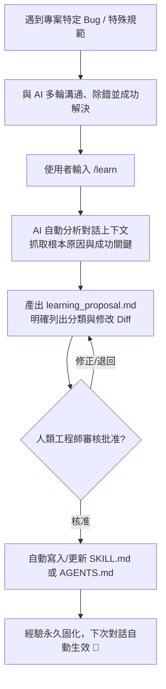

+++
title = '【AI工具】Agent Skills (三) - 自我進化：結合 /learn 讓 AI 自動長出新技能'
date = '2026-08-25'
slug = 'agent-skills-self-evolution-learn'
description = '深入探討 AI 代理人的經驗沉澱與自我進化機制：如何透過 /learn 指令將日常對話的除錯經驗轉化為專案資產、Rule 與 Skill 的自動分類，以及撰寫高命中率 Skill description 的黃金心法。'
categories = ['AI工具', '開發工具']
tags = ['AI-Skills', '/learn', '自我進化', 'Antigravity', 'Agentic-Workflow']
keywords = ['/learn', 'Agent Skills', 'AI 自我進化', 'learning_proposal', 'Skill description', 'Antigravity learn']
image = '/image/rules_bridge_cover.png'
+++

## 前言

在系列前兩篇文章中，我們學會了如何手動撰寫 Skill 以及如何透過多代理人（Subagents）進行任務分工：
- [【AI工具】Agent Skills (一) - 核心架構、生命週期與跨工具實戰](/posts/rules-bridge-create-and-sync-ai-skills/)
- [【AI工具】Agent Skills (二) - 多 Agent 協作：為 Subagent 量身打造專屬技能](/posts/agent-skills-multi-agent-subagent-collaboration/)

然而，在實際專案開發中，我們最常遇到的無奈情況往往是：**「今天花了大把時間糾正 AI 的某個 Bug 或特殊 API 呼叫方式，明天開了新對話它又忘得一乾二淨，又得從頭糾正一次！」**

傳統對話的資訊是短暫的（Ephemeral），無法跨 Session 累積成專案資產。

要讓 AI 開發助手真正成為你的「長期資深搭檔」，系統必須具備**自我學習與經驗沉澱**的能力。

這正是現代 Agent 體系中極具革命性的功能：**`/learn`（學習指令）**！

這篇文章將帶你深入了解 `/learn` 如何從對話歷史中提煉精華、自動分類 Rule 與 Skill，並示範如何讓 AI 在對話中自己長出新技能。

---

## 一、`/learn` 是什麼？從除錯經驗到專案資產的轉化器

傳統使用 AI 時，我們遇到錯誤會在對話中給予大量修正（Corrections）。但一旦按下「New Chat」，這些寶貴的除錯過程就隨之灰飛煙滅。

`/learn` 指令的作用，就是讓 AI **回顧最近的對話歷史，分析你給予的糾正與最終成功的解法，並自動將其固化為專案的資產**。



### `/learn` 的三大核心步驟：
1. **提煉關鍵解法（Root Cause Isolation）**：AI 會比對失敗的嘗試與最後成功的解法，抽離出核心關鍵，而不是盲目記錄所有廢話。
2. **規則 vs 技能自動分類（Rule vs. Skill Classification）**：AI 會自主判斷這次的經驗應該沉澱為全域守則（Rule）還是多步驟操作（Skill）。
3. **提案審查機制（Mandatory Proposal）**：AI 不會擅自亂改設定，而是先產生一份 `learning_proposal.md` 供你審查，按下核准後才正式寫入檔案。

---

### 💡 為什麼我的 VS Code 找不到 `/learn` 指令？

許多開發者在 VS Code GitHub Copilot 中嘗試輸入 `/learn` 卻發現沒有反應，這是因為**不同 AI 工具的指令實作方式不同**：

| AI 開發環境 | 經驗沉澱與自我進化的觸發方式 | 說明 |
| :--- | :--- | :--- |
| **Antigravity / Gemini CLI** | 原生斜線指令 **`/learn`** | 內建自動分析、產生 `learning_proposal.md` 審查提案並寫入 `.agents/`。 |
| **VS Code GitHub Copilot** | **自然語言指令（Prompt-driven）** | Copilot 尚未內建 `/learn` 斜線指令，但可直接下達指令：<br>👉 *「請將剛才解決問題的 SOP 總結並寫入 `.github/skills/<name>/SKILL.md`」*<br>👉 *「請將這條約束補充至 `.github/copilot-instructions.md`」* |
| **Claude Code** | **`/memory` 或指示更新 `CLAUDE.md`** | 透過記憶管理指令或直接要求 AI 更新專案根目錄的引導文件。 |
| **Cursor** | **自然語言指示生成 `.mdc`** | 直接在 Chat 中指示：*「請將本次規則固化為 `.cursor/rules/<name>.mdc`」*。 |

> 📌 **核心觀念**：不論工具是否有內建名為 `/learn` 的快捷指令，**「在解決複雜問題後，立刻要求 AI 將經驗提煉為持久的 Rule 或 Skill」** 這個自我進化的工程方法論是完全通用且一致的！

---

## 二、Rule（規則） vs Skill（技能）的自動分類標準

當你執行 `/learn` 時，AI 如何決定是要修改 `AGENTS.md` 還是建立一個新的 `SKILL.md`？

| 分類維度 | 📜 Rule（規則 / 約束） | 🛠️ Skill（技能 / SOP） |
| :--- | :--- | :--- |
| **定義本質** | **不可違背的行為邊界與約束** | **多步驟的操作流程與工具鏈** |
| **儲存位置** | `AGENTS.md` / `GEMINI.md` | `.agents/skills/<name>/SKILL.md` |
| **載入方式** | 全域或特定目錄下常駐生效 | 隨取隨用（On-Demand 語意動態命中） |
| **典型範例** | - 「文章一律使用繁體中文」<br>- 「嚴禁直接 Push 到 main 分支」<br>- 「變數命名一律採用 camelCase」 | - 「Playwright 瀏覽器測試自動化流程」<br>- 「部落格發布與圖片轉換 WebP 流程」<br>- 「Database Migration 建立與執行 SOP」 |

`/learn` 能夠精準辨識這兩者的邊界，避免把冗長的操作流程塞進全域規則導致 Context 膨脹。

---

## 三、Skill Description：語意觸發的靈魂樞紐

當 `/learn` 自動產出一個新的 `SKILL.md` 時，決定這個技能「未來能不能被精準呼叫」的關鍵，就是 YAML Frontmatter 中的 **`description`**！

### 為什麼 Description 如此重要？（漸進式揭露機制）
在現代 Agent 系統（如 Antigravity、Claude Code）中，為了不浪費 Token，系統採用 **漸進式揭露（Progressive Disclosure）**：
- **平日狀態**：AI 的 Context 裡**只有所有 Skills 的 `name` 與 `description`**，完全不載入主體內容。
- **觸發狀態**：只有當使用者輸入的語意命中 `description` 時，AI 才會動態載入該 Skill 的完整 SOP。

### ✍️ 高命中率 Description 的黃金撰寫公式：

> **`[功能核心動詞 + 處理對象] + [具體適用時機與情境] + [觸發關鍵字清單]`**

```yaml
---
name: hugo-image-optimizer
description: |
  自動壓縮部落格圖片並轉換為 WebP 格式，最佳化載入效能。
  適用時機：當新增封面圖片、文章截圖太大、最佳化圖片、壓縮圖片、convert webp 時使用。
---
```

如果 description 寫得太籠統（例如只寫「*處理圖片*」），AI 在遇到具體問題時就不敢貿然啟動該技能。

---

## 四、實戰示範：用 `/learn` 自動長出一個新 Skill

假設我們在寫文章時遇到了一個常見問題：封面圖片檔名有空格，導致靜態編譯時連結失效。

我們在對話中與 AI 進行排查，並成功寫出了一個格式檢查的邏輯。此時，我們直接輸入：

```text
/learn
```

### 1. AI 自動分析並產出提案 (`learning_proposal.md`)

```markdown
# Learning Proposal

## 分類判定
- **類別**：Skill（多步驟檢查 SOP）
- **建議名稱**：`blog-image-lint`
- **存放路徑**：`.agents/skills/blog-image-lint/SKILL.md`

## 提議內容
---
name: blog-image-lint
description: |
  檢查文章 Frontmatter 封面圖片路徑與檔名格式，防止空格與 404 死鏈。
  關鍵字：檢查圖片, 圖片格式, image lint, 修正圖片路徑
---

# Skill: 部落格圖片格式驗證

## 驗證規則
1. 圖片路徑必須以 `/image/` 開頭。
2. 檔名不得包含空格，必須使用破折號 `-` 或底線 `_`。
3. 檔案必須實際存在於 `static/image/` 目錄中。
```

### 2. 人類工程師審核
在 UI 上點擊 **「Proceed / 批准」** 按鈕後，AI 自動建立該 Skill。從此以後，專案中就多了一個永久有效的自動檢查能力！

---

## 五、最佳實踐與避坑指南

### ❌ 常見地雷（Don'ts）
1. **記錄過度特殊的偶然案例**：如果某個 Bug 只發生過一次且未來不會再出現，不需要 `/learn`。
2. **過度約束（Over-constraining）**：在 Rule 中寫死太多死板要求，會大幅削弱大模型的推理與靈活性。
3. **模糊的 Description**：讓 Description 充滿歧義，會導致 AI 在不相關的任務中誤觸技能。

### ✅ 最佳原則（Dos）
1. **即時總結**：每當成功解決一個複雜的環境設定或罕見 Bug，立刻在對話最後輸入 `/learn`，趁上下文最新鮮時提煉資產。
2. **優先更新既有 Skill**：如果既有 Skill 遺漏了邊界條件，優先請 `/learn` 更新舊檔案，避免技能碎片化。
3. **建立團隊共享的技能資產庫**：將 `/learn` 生成的 `.agents/skills/` 納入 Git 版本控管，讓團隊所有成員享受相同的成長紅利！

---

## 結論

AI 輔助開發的最高境界，不是寫出一套永遠不變的靜態 Prompt，而是打造一個**「具備自我修復與演進能力」的智慧工作區**。

透過 **`/learn`** 與精準的 **`Skill Description`**，我們把每一次的除錯成本轉化為長期的專案資產，讓 AI 真正做到「越用越聰明」！

---

## 參考文件與延伸閱讀

1. **Google DeepMind / Antigravity 官方指南**  
   - [Antigravity Customization System Guide](https://github.com/google-deepmind) — 深入解析 Skills、Rules、Plugins 與 `/learn` 機制的架構規範。
2. **Anthropic 官方研究指南**  
   - [Building Effective Agents](https://www.anthropic.com/research/building-effective-agents) — 探討代理人記憶沉澱（Agentic Memory）與動態 SOP 載入模式。
3. **開源規則與技能橋接器**  
   - [GitHub - JontCont/rules-bridge](https://github.com/JontCont/rules-bridge) — 實現 AI 開發規範跨 GitHub Copilot、Cursor、Antigravity 自動同步。

---

> 🔗 **系列文章導覽**：
> - [【AI工具】Agent Skills (一) - 核心架構、生命週期與跨工具實戰](/posts/rules-bridge-create-and-sync-ai-skills/)
> - [【AI工具】Agent Skills (二) - 多 Agent 協作：為 Subagent 量身打造專屬技能](/posts/agent-skills-multi-agent-subagent-collaboration/)
> - **【AI工具】Agent Skills (三) - 自我進化：結合 /learn 讓 AI 自動長出新技能**（本篇）
> - [【AI工具】Agent Skills (四) - 生命週期攔截：Lifecycle Hooks 全自動防呆與守護機制](/posts/agent-skills-lifecycle-hooks/)
