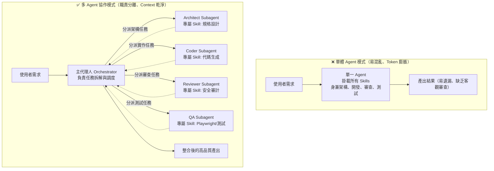

+++
title = '【AI工具】Agent Skills (二) - 多 Agent 協作：為 Subagent 量身打造專屬技能'
date = '2026-08-25'
slug = 'agent-skills-multi-agent-subagent-collaboration'
description = '深入探討多代理人架構（Multi-Agent System），解析 Subagent 來源、Token 經濟學、各大工具實作現況（Claude、Gemini、Copilot），以及如何為子代理人配置專屬 Skills 實現高效協作。'
categories = ['AI工具', '開發工具']
tags = ['AI-Agent', 'Subagents', 'Agent-Skills', 'Antigravity', '多代理人']
keywords = ['Subagent', 'Multi-Agent', 'Agent Skills', '多代理人協作', 'AI 開發團隊', 'Claude Code', 'GitHub Copilot']
image = '/image/agent_chat_cover.png'
+++

## 前言

在 [【AI工具】Agent Skills (一) - 核心架構、生命週期與跨工具實戰](/posts/rules-bridge-create-and-sync-ai-skills/) 中，我們介紹了如何將 SOP 與工具封裝成獨立的 Skill，讓單一 AI 助手具備特定領域的執行能力。

然而，當專案規模擴大、任務變得複雜時（例如：「請幫我開發一個會員註冊功能，包含 API、前端畫面、安全性審查、單元測試並自動產生發布紀錄」），如果只依賴**單一個 AI Agent** 來處理所有事情，往往會面臨嚴重的瓶頸：

1. **上下文污染（Context Rot）**：對話長度暴增，AI 開始遺忘前面的指示或產生幻覺。
2. **角色混亂與權限失控**：同一個 Agent 既要寫程式又要自我審查，容易「當球員又當裁判」，漏掉重大漏洞。
3. **Token 消耗巨大**：把所有技能與文件一股腦塞進同一個對話，每次請求都在重複傳送大量無關歷史。

解法就是：**多代理人協作架構（Multi-Agent System）+ 角色特化技能（Role-Specific Skills）**！

這篇文章將帶你深入了解 Subagent 的來源途徑、底層 Token 運算機制、主流工具實作現況，以及如何為不同的子代理人打造專屬技能。

---

## 一、單體 Agent vs 多 Agent 分工架構

在軟體工程中，我們遵循「單一職責原則（Single Responsibility Principle）」，而這個原則在 AI 系統中同樣適用。



### 多 Agent 協作的核心優勢：
- **獨立的 Context 視窗**：每個 Subagent 在自己乾淨的對話視窗中工作，任務完成後只將「結論」回傳給主代理人，徹底避免上下文污染。
- **最小權限原則（Least Privilege）**：負責審查的 Agent 只給唯讀權限；負責執行的 Agent 才給終端機操作權限。
- **平行作業（Parallel Execution）**：多個獨立任務（例如前端與後端實作）可由不同子代理人同時進行，大幅縮短等待時間。

---

## 二、Subagent 是從哪裡來的？與技能配置矩陣

在探討技能隔離之前，許多開發者常有的疑問是：**「這些 Subagent 到底從何而來？是事先寫好的還是 AI 自己生出來的？」**

實務上，Subagent 主要來自以下 **三大來源途徑**：

### 1. 系統內建代理人（Built-in Subagents）
工具原廠預先定義好的標準角色，開箱即用：
- 例如 Antigravity 的 `research`（唯讀研究代理人）、`self`（繼承父層能力的同質代理人）。
- 例如 Claude Code 的 `Explore`（快速程式庫檢索）與 `Plan`（高層任務規劃）。

### 2. 專案設定自訂代理人（Project-defined Custom Agents）
開發者在專案目錄下透過 Markdown 檔案靜態宣告的特定角色：
- 存放於 `.agents/agents/`、`.claude/agents/` 或 `.github/agents/`。
- 檔案中透過 YAML Frontmatter 明確定義該角色的職責、專用 Prompt 與工具白名單（例如 `security-reviewer.md`）。

### 3. 動態即時建立（On-the-fly Dynamic Subagents / Spawning）
主 Agent 在執行任務時，根據臨時需求**現場動態宣告並 Spawn（建立）**：
- 透過 `define_subagent` 或類似 API，即時指定臨時角色的 Prompt、模型大小與權限，任務完成後即刻銷毀，具備極高的彈性。

---

### Subagent 的技能隔離原則與配置矩陣

釐清了 Subagent 的來源後，在指派任務時**切忌將專案內所有 Skills 通通發給每一個 Subagent**。我們應該根據角色職責進行嚴格的技能隔離與配置：

| 代理人角色 (Subagent Role) | 建議系統權限 | 專屬掛載 Skills | 核心職責 |
| :--- | :--- | :--- | :--- |
| **Orchestrator（主調度員）** | 具備任務分發工具 | `task-planner`, `progress-tracker` | 理解使用者意圖、拆解任務、分發給 Subagents、彙整最終產出 |
| **Architect（架構設計師）** | 唯讀檔案權限 | `api-spec-designer`, `db-schema-designer` | 產出標準架構文件與資料表規格，不直接寫代碼 |
| **Coder（代碼實作員）** | 檔案讀寫權限 | `frontend-design`, `csharp-coding-standard` | 依據規格文件專心產出高品質程式碼 |
| **Security Reviewer（安全審查員）** | 唯讀檔案權限 | `security-audit`, `owasp-check` | 獨立客觀審查程式碼，抓取 SQL Injection、XSS 等資安隱患 |
| **QA Engineer（測試工程師）** | 終端機執行權限 | `playwright-test`, `unit-test-runner` | 撰寫並執行測試腳本，產出測試報告 |

---

## 三、各大主流工具的 Subagent 實作現況與觸發機制

不同 AI 開發工具在多代理人的實作進度、配置路徑與觸發哲學上各有不同：

### 1. Claude Code / Anthropic（Subagent 概念的先驅）
Anthropic 是最早將 Subagent 架構產品化的先驅之一：
- **目錄配置**：支援在 `~/.claude/agents/` 或專案 `.claude/agents/*.md` 中定義專屬代理人。
- **內建代理人**：預設提供 `Explore`（程式庫探索）與 `Plan`（架構規劃）等內建子代理人。
- **模型分級調度**：允許為 Subagent 配置更輕量的模型（如 Haiku）來跑常規檢索，把頂級模型（如 Sonnet / Opus）保留給主對話的複雜決策，兼顧速度與 Token 成本。

### 2. Gemini / Antigravity（原生深度整合的多代理體系）
Gemini / Antigravity 近期全面引進了原生的 Subagent 體系，將多代理人調度提升至系統層級：
- **動態召喚與自定義**：支援 `invoke_subagent`（呼叫內建或既有代理人）與 `define_subagent`（即時宣告新角色、自訂 System Prompt 與專屬工具）。
- **工作區隔離（Workspace Mode）**：支援 `inherit`（繼承環境）、`branch`（建立獨立分支環境）與 `share`（共享環境），讓子代理人可以在沙盒分支中大膽測試與重構，不污染主專案。
- **反應式喚醒（Reactive Wakeup）**：每個 Subagent 擁有獨立的日誌（Transcript），主 Agent 派發任務後會進入非同步等待，當子代理人完成時系統自動喚醒主 Agent，無需手動輪詢（No Polling）。

### 3. GitHub Copilot（工具依賴與 CLI Fleet 模式）
在 GitHub Copilot 生態系中，多代理人架構依使用環境提供了靈活的控制方式：
- **Copilot CLI 的 Fleet（代理艦隊）模式**：在命令列環境中可啟用 Fleet 模式，讓主 Agent 同時調度多個背景 CLI Agent 並行處理不同的子任務。
- **VS Code 中的 Subagent 委派**：在 IDE 介面中需開啟 Tool Use / Function Calling，並透過設定 `chat.customAgentInSubagent.enabled` 允許主 Agent 使用 `#runSubagent` 工具調度子代理人。
- **雲端非同步委派（`/delegate`）**：在 Copilot CLI 中，可使用 `/delegate` 指令將耗時的複雜任務直接拋轉給 GitHub 雲端背景 Agent，自動在遠端建立分支與 Draft Pull Request，釋放本機資源。

---

## 四、單一注入 vs 呼叫 Subagent：AI 是如何判斷的？與 Token 經濟學

### 1. AI 決策機制：什麼時候直接做？什麼時候派工？
Skills 本身只是「能力說明書」，它不決定由誰執行。AI 通常依據以下原則決策：
- **預設模式（Direct Injection）**：任務單純（如修改單一檔案、回答概念），直接把 `SKILL.md` 注入當前對話由主 Agent 親自執行。
- **規則強制要求（Rule-driven）**：Prompt 或 `SKILL.md` 中明確寫明「請調用子代理人執行審查」，AI 即觸發派工工具。
- **複雜度與噪聲門檻（Complexity Threshold）**：遇到需要跨數十個檔案搜尋或跑長耗時測試時，Planner 自動在背景 **Spawn Subagent** 避免污染主對話。

### 2. Token 與 API 運作真相：為什麼 Subagent 反而更省？
- **認證金鑰（Credentials）**：Subagent 直接繼承父層環境的授權（如 Copilot 訂閱、API Key），無需額外配置。
- **Token 消耗與隔離效益**：
  - 若在主對話讀取 50 個檔案（消耗 50,000 Tokens），這 50,000 Tokens 會永遠留在歷史紀錄中，導致後續**每一輪提問都在重複計費**。
  - Subagent 在獨立空間中消耗 50,000 Tokens 後，**只回傳 500 Tokens 的結論**給主對話。長遠來看大幅降低了後續對話的總 Token 支出與延遲！
- **模型分級（Model Routing）**：主 Agent 使用頂級大腦（如 Gemini Pro / Claude Sonnet），Subagent 打雜使用輕量模型（如 Flash Lite / Haiku），達到成本與效能的最佳平衡。

---

## 五、網頁平台（Browser） vs 本機工作區（IDE / CLI）的架構鴻溝

許多人好奇：「為什麼我們在 ChatGPT 或 Claude 網頁版聊天時，感覺不到這種多代理人拆解？」

| 比較維度 | 🌐 網頁版平台（Browser Web Chat） | 💻 本機 IDE / CLI 代理人（如 Antigravity / Claude Code） |
| :--- | :--- | :--- |
| **運作架構** | **單一線性對話流（Single Agent）**<br>所有互動皆在同一個對話 Session 中依序累積。 | **分散式多代理人系統（Multi-Agent Orchestration）**<br>主 Agent 可在背景調度多個獨立 Subagent。 |
| **環境邊界** | **雲端封閉沙盒**<br>無法直接讀寫本機專案檔案或調用本地 Git。 | **本機工作區（Local Workspace）**<br>具備檔案系統、終端機、Git 分支與編譯器完整控制權。 |
| **多工處理** | **同步阻塞（Blocking）**<br>AI 在搜尋或執行時，畫面只能等待旋轉指示器。 | **非同步背景平行（Async & Branching）**<br>多個 Subagent 可在獨立分支同時搜尋與測試。 |
| **擴充深度** | **自訂 Prompt（如 Custom GPTs / Projects）**<br>本質仍是預先載入的長提示詞。 | **標準 Agent Skills 體系**<br>`SKILL.md` + 實體腳本（`scripts/`）+ MCP 工具串接。 |

網頁版適合單一對話諮詢；而面對真實世界的軟體工程重構、測試與發布，具備本機工作區的 **IDE / CLI 多代理人體系** 才是真正的生產力引擎。

---

## 六、Subagent 可以關閉嗎？配置與控制技巧

若處於除錯階段（想即時看到每一行指令 log），或是任務非常單純想避免額外調度，Subagent 是**完全可以關閉或限制的**：

1. **透過 IDE / CLI 設定關閉**：
   - 在 VS Code 中設定 `"chat.customAgentInSubagent.enabled": false`，或在 Chat 工具面板中取消勾選 `#runSubagent` 工具。
2. **透過全域規則（`AGENTS.md`）強制禁止**：
   - 在專案根目錄的 `AGENTS.md` 寫入：「*請勿調用或 Spawn 任何 Subagent，所有操作一律由主 Agent 在當前對話中直接執行。*」
3. **透過工具權限限制**：
   - 定義 Agent 時不裝載 `invoke_subagent` 或 `define_subagent` 工具，AI 自然只能親自執行。

---

## 七、實戰示範：在 Antigravity 中配置 Subagents 與專屬 Skills

我們以目前開發環境為例，示範如何定義具備專屬技能的 Subagent。

### Step 1 — 建立角色專屬的 Skill

假設我們要為「代碼審查員」建立一個專用的 `code-review` 技能：

在 `.agents/skills/code-review/` 下建立 `SKILL.md`：

```yaml
---
name: code-review
description: |
  獨立審查代碼品質、資安隱患與架構規範。
  適用時機：審查 Pull Request、檢查安全漏洞、驗證 Coding Style。
---

# Skill: 代碼品質與安全性審查

## 審查重點
1. **安全性（Security）**：檢查是否有未過濾的 SQL 查詢、敏感資訊洩漏或 XSS 風險。
2. **效能（Performance）**：檢查是否有 N+1 Query、未釋放的連線資源或記憶體洩漏。
3. **規範（Conventions）**：確認變數命名、目錄分層是否符合專案規範。

## 輸出格式
一律以 Markdown 表格呈現問題清單，標註嚴重程度（`[Critical]`, `[Warning]`, `[Info]`）與具體修復建議。
```

### Step 2 — 主代理人調度 Subagent（動態派工）

主代理人（Orchestrator）在收到任務後，透過 `invoke_subagent` 工具動態召喚專屬子代理人：

```python
# 主 Agent 的調度邏輯範例
invoke_subagent(
    TypeName="research",
    Role="Security Reviewer",
    Prompt="""
    請針對剛剛 Coder 產出的 UserService.cs 進行安全性審查。
    請啟用 code-review 技能，並以嚴重程度表格回傳審查報告。
    """
)
```

子代理人在獨立的空間中啟動、載入 `code-review` 技能、讀取程式碼進行分析，並在完成後回傳精準的審查結論給主代理人。

---

## 八、完整協作情境：端到端發布流程

以本部落格的「新文章發布與審查」為例，看看多 Agent 如何協同作業：

```text
[使用者] ➔ 「我想寫一篇關於 Playwright 的教學文章，完成後幫我檢查排版並提交 Git」
    │
    ▼
[Orchestrator 主代理人] 接收指令，拆解為 3 個子任務：
    │
    ├── 1. 召喚【Writer Subagent】
    │      掛載技能：add-post
    │      執行產出：content/posts/2026-08-25-Playwright-教學.md
    │      回報：文章撰寫完成 ✅
    │
    ├── 2. 召喚【Reviewer Subagent】
    │      掛載技能：frontend-design / blog-lint
    │      執行檢查：確認 TOML Frontmatter 格式、圖片路徑、程式碼標籤
    │      回報：排版檢查通過，無格式錯誤 ✅
    │
    └── 3. 召喚【Git Subagent】
           掛載技能：git
           執行操作：產生 post(Playwright): 新增教學文章 Commit 並 Push
           回報：Commit 完成 ✅
    │
    ▼
[Orchestrator 主代理人] 彙整全部進度，向使用者回報最終結果 🚀
```

整個過程中，每個 Subagent 只接觸自己需要的 Context，不僅速度更快、產出更精確，而且完全不會互相干擾！

---

## 九、多 Agent Skills 系統的最佳實踐與避坑指南

### 1. 控制溝通邊界，避免「訊息風暴」
- **原則**：子代理人完成任務後，**只回傳核心結論與結構化摘要**，不要把幾千行的中間對話紀錄整串倒回給主代理人。

### 2. 角色分工要純粹（Separation of Concerns）
- 讓負責「實作」的人專心實作，負責「審查」的人專心找碴。**切忌讓實作者自行調用審查技能並自我判定通過**，這會失去多 Agent 制衡的意義。

### 3. 善用獨立工作目錄（Workspace Isolation）
- 如果 Subagent 需要進行破壞性測試或編譯驗證，可讓其在獨立的分支（Branch）或臨時工作目錄中執行，確保主專案工作區的安全。

---

## 結論

從「單一 Agent」走向「多 Agent 協作」，是打造現代自動化 AI 工程團隊的必然趨勢。

透過 **角色特化（Specialized Roles）** 與 **專屬技能掛載（Dedicated Skills）**，我們不僅解決了長上下文的遺忘與幻覺問題，更建立了一套具備自我檢查、平行分工與高擴展性的 AI 開發流水線！

---

## 參考文件與延伸閱讀

1. **Anthropic 官方研究指南**  
   - [Building Effective Agents](https://www.anthropic.com/research/building-effective-agents) — 深入探討 Orchestrator-Worker 架構、Subagents 任務委派與 Context 隔離模式。
2. **Visual Studio Code 官方文件**  
   - [Subagents in Visual Studio Code](https://code.visualstudio.com/docs/copilot/agents/subagents) — VS Code GitHub Copilot Subagents 設定、自訂代理人與調度機制。
   - [VS Code Copilot Custom Agents](https://code.visualstudio.com/docs/copilot/agents/agents-tutorial) — 如何在 VS Code 中定義與啟用客製化 Agent。
3. **Google DeepMind / Gemini Agent 架構**  
   - [Antigravity Customization & Multi-Agent Guide](https://github.com/google-deepmind) — 探討基於獨立 Workspace、動態 `invoke_subagent` 與反應式日誌的多代理人體系。
4. **開源規則與技能橋接器**  
   - [GitHub - JontCont/rules-bridge](https://github.com/JontCont/rules-bridge) — 實現 AGENTS.md 與 Agent Skills 跨 GitHub Copilot、Cursor、Antigravity 一鍵同步工具。

---

> 🔗 **系列文章導覽**：
> - [【AI工具】Agent Skills (一) - 核心架構、生命週期與跨工具實戰](/posts/rules-bridge-create-and-sync-ai-skills/)
> - **【AI工具】Agent Skills (二) - 多 Agent 協作：為 Subagent 量身打造專屬技能**（本篇）
> - [【AI工具】Agent Skills (三) - 自我進化：結合 /learn 讓 AI 自動長出新技能](/posts/agent-skills-self-evolution-learn/)
> - [【AI工具】Agent Skills (四) - 生命週期攔截：Lifecycle Hooks 全自動防呆與守護機制](/posts/agent-skills-lifecycle-hooks/)
