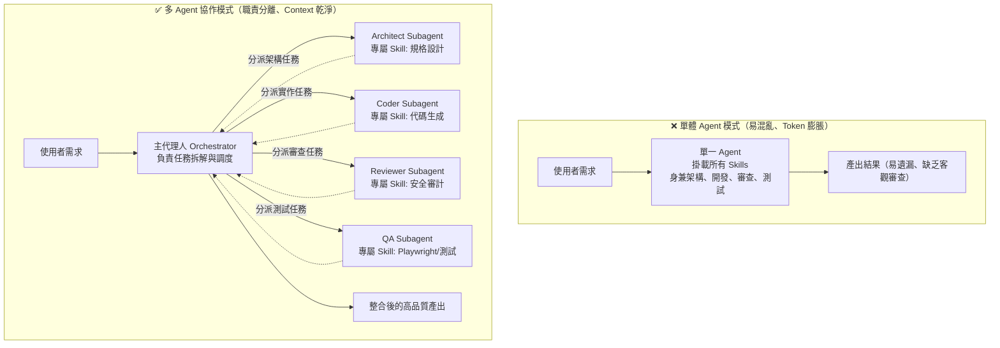

+++
title = '【AI工具】Agent Skills (二) - 多 Agent 協作：為 Subagent 量身打造專屬技能'
date = '2026-08-25'
slug = 'agent-skills-multi-agent-subagent-collaboration'
description = '深入探討多代理人架構（Multi-Agent System），示範如何將不同 Agent 角色（規劃、開發、審查、測試）與專屬 Skills 解耦，建立高效且不互相污染的高品質自動化團隊。'
categories = ['AI工具', '開發工具']
tags = ['AI-Agent', 'Subagents', 'Agent-Skills', 'Antigravity', '多代理人']
keywords = ['Subagent', 'Multi-Agent', 'Agent Skills', '多代理人協作', 'AI 開發團隊']
image = '/image/agent_chat_cover.png'
+++

## 前言

在 [【AI工具】Agent Skills (一) - 核心架構、生命週期與跨工具實戰](/2026/06/28/rules-bridge-create-and-sync-ai-skills/) 中，我們介紹了如何將 SOP 與工具封裝成獨立的 Skill，讓單一 AI 助手具備特定領域的執行能力。

然而，當專案規模擴大、任務變得複雜時（例如：「請幫我開發一個會員註冊功能，包含 API、前端畫面、安全性審查、單元測試並自動產生發布紀錄」），如果只依賴**單一個 AI Agent** 來處理所有事情，往往會面臨嚴重的瓶頸：

1. **上下文污染（Context Rot）**：對話長度暴增，AI 開始遺忘前面的指示或產生幻覺。
2. **角色混亂與權限失控**：同一個 Agent 既要寫程式又要自我審查，容易「當球員又當裁判」，漏掉重大漏洞。
3. **Token 消耗巨大**：把所有技能與文件一股腦塞進同一個對話，每次請求都在浪費大量算力。

解法就是：**多代理人協作架構（Multi-Agent System）+ 角色特化技能（Role-Specific Skills）**！

這篇文章將帶你了解如何將複雜任務拆解，並為不同的子代理人（Subagent）量身打造專屬技能，打造一支分工明確的 AI 開發團隊。

---

## 一、單體 Agent vs 多 Agent 分工架構

在軟體工程中，我們遵循「單一職責原則（Single Responsibility Principle）」，而這個原則在 AI 系統中同樣適用。



### 多 Agent 協作的核心優勢：
- **獨立的 Context 視窗**：每個 Subagent 在自己乾淨的對話視窗中工作，任務完成後只將「結論」回傳給主代理人，徹底避免上下文污染。
- **最小權限原則（Least Privilege）**：負責審查的 Agent 只給唯讀權限；負責執行的 Agent 才給終端機操作權限。
- **平行作業（Parallel Execution）**：多個獨立任務（例如前端與後端實作）可由不同子代理人同時進行，大幅縮短等待時間。

---

## 二、Subagent 的技能隔離與配置矩陣

在設計多代理人系統時，**切忌將專案內所有 Skills 通通發給每一個 Subagent**。我們應該根據角色職責進行技能配置：

| 代理人角色 (Subagent Role) | 建議系統權限 | 專屬掛載 Skills | 核心職責 |
| :--- | :--- | :--- | :--- |
| **Orchestrator（主調度員）** | 具備任務分發工具 | `task-planner`, `progress-tracker` | 理解使用者意圖、拆解任務、分發給 Subagents、彙整最終產出 |
| **Architect（架構設計師）** | 唯讀檔案權限 | `api-spec-designer`, `db-schema-designer` | 產出標準架構文件與資料表規格，不直接寫代碼 |
| **Coder（代碼實作員）** | 檔案讀寫權限 | `frontend-design`, `csharp-coding-standard` | 依據規格文件專心產出高品質程式碼 |
| **Security Reviewer（安全審查員）** | 唯讀檔案權限 | `security-audit`, `owasp-check` | 獨立客觀審查程式碼，抓取 SQL Injection、XSS 等資安隱患 |
| **QA Engineer（測試工程師）** | 終端機執行權限 | `playwright-test`, `unit-test-runner` | 撰寫並執行測試腳本，產出測試報告 |

---

## 三、實戰示範：在 Antigravity 中配置 Subagents 與專屬 Skills

我們以目前開發環境為例，示範如何定義具備專屬技能的 Subagent。

### Step 1 — 建立角色專屬的 Skill

假設我們要為「代碼審查員」建立一個專用的 `code-review` 技能：

在 `.agents/skills/code-review/` 下建立 `SKILL.md`：

```yaml
---
name: code-review
description: |
  獨立審查代碼品質、資安隱患與架構規範。
  適用時機：審查 Pull Request、檢查安全漏洞、驗證 Coding Style。
---

# Skill: 代碼品質與安全性審查

## 審查重點
1. **安全性（Security）**：檢查是否有未過濾的 SQL 查詢、敏感資訊洩漏或 XSS 風險。
2. **效能（Performance）**：檢查是否有 N+1 Query、未釋放的連線資源或記憶體洩漏。
3. **規範（Conventions）**：確認變數命名、目錄分層是否符合專案規範。

## 輸出格式
一律以 Markdown 表格呈現問題清單，標註嚴重程度（`[Critical]`, `[Warning]`, `[Info]`）與具體修復建議。
```

### Step 2 — 主代理人調度 Subagent（動態派工）

主代理人（Orchestrator）在收到任務後，透過 `invoke_subagent` 工具動態召喚專屬子代理人：

```python
# 主 Agent 的調度邏輯範例
invoke_subagent(
    TypeName="research",
    Role="Security Reviewer",
    Prompt="""
    請針對剛剛 Coder 產出的 UserService.cs 進行安全性審查。
    請啟用 code-review 技能，並以嚴重程度表格回傳審查報告。
    """
)
```

子代理人在獨立的空間中啟動、載入 `code-review` 技能、讀取程式碼進行分析，並在完成後回傳精準的審查結論給主代理人。

---

## 四、完整協作情境：端到端發布流程

以本部落格的「新文章發布與審查」為例，看看多 Agent 如何協同作業：

```text
[使用者] ➔ 「我想寫一篇關於 Playwright 的教學文章，完成後幫我檢查排版並提交 Git」
    │
    ▼
[Orchestrator 主代理人] 接收指令，拆解為 3 個子任務：
    │
    ├── 1. 召喚【Writer Subagent】
    │      掛載技能：add-post
    │      執行產出：content/posts/2026-06-28-Playwright-教學.md
    │      回報：文章撰寫完成 ✅
    │
    ├── 2. 召喚【Reviewer Subagent】
    │      掛載技能：frontend-design / blog-lint
    │      執行檢查：確認 TOML Frontmatter 格式、圖片路徑、程式碼標籤
    │      回報：排版檢查通過，無格式錯誤 ✅
    │
    └── 3. 召喚【Git Subagent】
           掛載技能：git
           執行操作：產生 post(Playwright): 新增教學文章 Commit 並 Push
           回報：Commit 完成 ✅
    │
    ▼
[Orchestrator 主代理人] 彙整全部進度，向使用者回報最終結果 🚀
```

整個過程中，每個 Subagent 只接觸自己需要的 Context，不僅速度更快、產出更精確，而且完全不會互相干擾！

---

## 五、多 Agent Skills 系統的最佳實踐與避坑指南

### 1. 控制溝通邊界，避免「訊息風暴」
- **原則**：子代理人完成任務後，**只回傳核心結論與結構化摘要**，不要把幾千行的中間對話紀錄整串倒回給主代理人。

### 2. 角色分工要純粹（Separation of Concerns）
- 讓負責「實作」的人專心實作，負責「審查」的人專心找碴。**切忌讓實作者自行調用審查技能並自我判定通過**，這會失去多 Agent 制衡的意義。

### 3. 善用獨立工作目錄（Workspace Isolation）
- 如果 Subagent 需要進行破壞性測試或編譯驗證，可讓其在獨立的分支（Branch）或臨時工作目錄中執行，確保主專案工作區的安全。

---

## 結論

從「單一 Agent」走向「多 Agent 協作」，是打造現代自動化 AI 工程團隊的必然趨勢。

透過 **角色特化（Specialized Roles）** 與 **專屬技能掛載（Dedicated Skills）**，我們不僅解決了長上下文的遺忘與幻覺問題，更建立了一套具備自我檢查、平行分工與高擴展性的 AI 開發流水線！

---

> 🔗 **系列文章導覽**：
> - [【AI工具】Agent Skills (一) - 核心架構、生命週期與跨工具實戰](/2026/06/28/rules-bridge-create-and-sync-ai-skills/)
> - **【AI工具】Agent Skills (二) - 多 Agent 協作：為 Subagent 量身打造專屬技能**（本篇）
