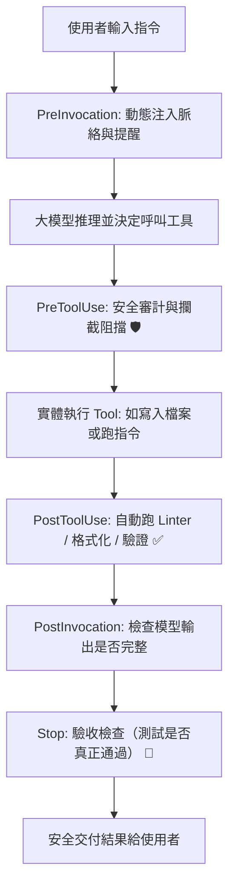

+++
title = '【AI工具】Agent Skills (四) - 生命週期攔截：Lifecycle Hooks 全自動防呆與守護機制'
date = '2026-08-25'
slug = 'agent-skills-lifecycle-hooks'
description = '深入解析 AI 代理人的生命週期鉤子（Lifecycle Hooks）機制：如何在 PreToolUse、PostToolUse、Stop 等關鍵節點掛載自動化檢查、安全防護與 Linter，打造零失誤的開發工作區。'
categories = ['AI工具', '開發工具']
tags = ['AI-Skills', 'Hooks', 'hooks.json', 'Antigravity', '自動化防呆']
keywords = ['Hooks', 'hooks.json', 'Lifecycle Hooks', 'PreToolUse', 'PostToolUse', 'AI 防呆', 'Antigravity Hooks']
image = '/image/rules_bridge_cover.png'
+++

## 前言

在系列前三篇文章中，我們完成了客製化 Skill 的開發、多代理人協作與 `/learn` 自我進化體系：
- [【AI工具】Agent Skills (一) - 核心架構、生命週期與跨工具實戰](/posts/rules-bridge-create-and-sync-ai-skills/)
- [【AI工具】Agent Skills (二) - 多 Agent 協作：為 Subagent 量身打造專屬技能](/posts/agent-skills-multi-agent-subagent-collaboration/)
- [【AI工具】Agent Skills (三) - 自我進化：結合 /learn 讓 AI 自動長出新技能](/posts/agent-skills-self-evolution-learn/)

然而，即便是最聰明的 AI 模型，偶爾還是會發生「漏跑格式化」、「執行了高危險指令」或「測試還沒跑完就搶先回報完成」的人性化疏失。

純粹依靠 Prompt 或文字規範來約束 AI，就像是「口頭交代規則」；而現代 Agent 體系提供了更底層的物理約束機制：**`Lifecycle Hooks`（生命週期鉤子）**！

透過 Hooks，我們可以在 AI 的整個執行生命週期中設置「事件監聽器」，在關鍵時刻強制介入、自動審查或修復，打造真正零失誤的開發守護系統！

---

## 一、什麼是 Lifecycle Hooks？

**Lifecycle Hooks** 是定義在 `.agents/hooks.json` 中的自動化規則，允許你在 AI 的執行迴圈（Execution Loop）特定生命週期節點，掛載外部 Shell 腳本進行攔截與審計。



### 核心特性：
- **實體命令執行**：Hooks 能夠直接執行本地的 Shell 腳本（`type: "command"`），具備完整的系統操作能力。
- **輸入輸出契約（JSON Contract）**：系統透過 `stdin` 將當前工具名稱、參數與上下文傳給腳本，腳本透過 `stdout` 回傳決策（如 `allow`、`deny`、`ask`）。
- **零 Token 浪費**：Hooks 的執行完全在本地背景進行，不占用昂貴的 LLM Context Token。

---

## 二、5 大核心生命週期事件詳解

在 `.agents/hooks.json` 中，你可以針對以下 5 個關鍵事件掛載處理器：

### 1. `PreToolUse`（工具執行前：安全守護與權限阻擋）
- **觸發時機**：在 AI 即將調用某個工具（如 `run_command`、`write_to_file`）**之前**觸發。
- **典型應用**：
  - 攔截高危險指令（如 `rm -rf`、`git push --force`）。
  - 對特定敏感目錄的修改強制彈出詢問視窗（`decision: "ask"`）。

### 2. `PostToolUse`（工具執行後：自動驗證與格式化）
- **觸發時機**：在工具執行完成**之後**立即觸發。
- **典型應用**：
  - AI 寫完代碼後，自動執行 Prettier / ESLint / C# Format 進行代碼排版。
  - 修改部落格文章後，自動檢查 TOML Frontmatter 與圖片路徑是否存在。

### 3. `PreInvocation`（模型推理前：動態脈絡注入）
- **觸發時機**：在每次將請求送往大語言模型**之前**觸發。
- **典型應用**：
  - 動態讀取當前 Git 分支名稱、最新 CI 狀態，並以臨時系統訊息（`ephemeralMessage`）注入對話，讓 AI 永遠掌握最新資訊。

### 4. `PostInvocation`（模型推理後：強制接續）
- **觸發時機**：在大模型回傳思考與工具呼叫後觸發。
- **典型應用**：
  - 檢查 AI 是否漏掉了步驟，必要時回傳 `terminationBehavior: "force_continue"` 強制讓 AI 繼續執行迴圈。

### 5. `Stop`（任務結束前：終點質量守門員）
- **觸發時機**：在 AI 認為任務已經完成、準備向使用者交差**之前**觸發。
- **典型應用**：
  - 檢查背景的單元測試或編譯是否全部通過。若發現測試失敗，回傳 `decision: "continue"` 阻止 AI 停止，並將錯誤原因注入對話要求 AI 修正。

---

## 三、實戰配置：撰寫第一個 `hooks.json`

我們以本部落格為例，建立一個完整的守護規則：
1. **防止危險指令**（`PreToolUse`）
2. **自動驗證文章格式**（`PostToolUse`）

### 1. 建立 `.agents/hooks.json`

```json
{
  "safety-guard": {
    "enabled": true,
    "PreToolUse": [
      {
        "matcher": "run_command",
        "hooks": [
          {
            "type": "command",
            "command": "./scripts/safety-check.sh",
            "timeout": 5
          }
        ]
      }
    ]
  },
  "blog-validator": {
    "enabled": true,
    "PostToolUse": [
      {
        "matcher": "write_to_file|replace_file_content",
        "hooks": [
          {
            "type": "command",
            "command": "./scripts/validate-post.sh",
            "timeout": 10
          }
        ]
      }
    ]
  }
}
```

### 2. 撰寫安全審查腳本 (`scripts/safety-check.sh`)

Hooks 透過 `stdin` 接收 JSON 資料，我們可以輕易用 Bash 或 Python 解析：

```bash
#!/bin/bash
# 讀取 stdin 的 JSON 輸入
INPUT=$(cat)
COMMAND=$(echo "$INPUT" | jq -r '.toolCall.args.CommandLine')

# 檢查是否包含危險指令
if [[ "$COMMAND" =~ "rm -rf" ]] || [[ "$COMMAND" =~ "push -f" ]]; then
  # 回傳拒絕決策
  echo '{"decision": "deny", "reason": "偵測到高危險指令，系統已自動攔截！"}'
  exit 0
fi

# 正常情況允許執行
echo '{"decision": "allow"}'
```

---

## 四、Hooks 與 Skills 的完美協同

當我們把 **Skills（SOP 指引）** 與 **Hooks（硬性攔截）** 結合時，就構成了「軟硬兼施」的最佳架構：

```text
[使用者需求]
    │
    ▼
【Skills (SOP)】➔ 告訴 AI「應該怎麼正確做」
    │
    ▼
【AI 執行操作】
    │
    ▼
【Hooks (Gate)】➔ 實體把關「確保沒有做錯或遺漏」
```

- **單有 Skill 沒有 Hook**：AI 可能會因為上下文太長而偶爾遺漏步驟。
- **單有 Hook 沒有 Skill**：AI 被 Hook 攔截報錯後不知道該如何修正。
- **兩者結合**：Skill 負責引導前進，Hook 負責兜底防呆，達到 100% 的執行穩定度！

---

## 五、Hooks 實務注意事項

1. **避免過長的執行時間**：Hooks 是**同步阻塞（Synchronous Blocking）**的，腳本執行期間 AI 迴圈會暫停等待。建議將單一 Hook 執行時間控制在 1~3 秒內。
2. **精準設定 `matcher`**：使用正規表示式精準命中目標工具（例如 `"matcher": "run_command"`），避免所有工具都被無差別觸發。
3. **避免死迴圈（Deadlock）**：在 `Stop` Hook 中設定 `continue` 時，務必確保有合理的終止條件，避免 AI 無限循環無法停止。

---

## 結論

透過本系列四篇文章的探索，我們完整構建了現代 AI Agent 的全套工程架構：

1. **第 (一) 篇**：掌握了 `SKILL.md` + `references/` 的**核心解剖架構與跨工具同步**；
2. **第 (二) 篇**：掌握了**多代理人（Subagents）架構、角色配置與工作區隔離**；
3. **第 (三) 篇**：利用 `/learn` 實現了**經驗沉澱與自動長出新技能**；
4. **第 (四) 篇**：藉由 `Lifecycle Hooks` 完成了**全自動的生命週期安全守護**。

從寫 Prompt 走向設計 Agent 系統，這套體系將讓你的 AI 開發助手真正發揮出百倍的工程生產力！

---

## 參考文件與延伸閱讀

1. **Google DeepMind / Antigravity 官方指南**  
   - [Antigravity Lifecycle Hooks Specification](https://github.com/google-deepmind) — `PreToolUse`、`PostToolUse`、`PreInvocation`、`Stop` 完整 JSON 規格與契約。
   - [Antigravity Customization System Guide](https://github.com/google-deepmind) — 深入解析 Skills、Rules、Plugins、Hooks 與 MCP 的載入優先順序。
2. **Anthropic 官方研究指南**  
   - [Building Effective Agents](https://www.anthropic.com/research/building-effective-agents) — 探討自動化護欄（Guardrails）與 Agentic 工作流設計。
3. **開源規則與技能橋接器**  
   - [GitHub - JontCont/rules-bridge](https://github.com/JontCont/rules-bridge) — 跨 GitHub Copilot、Cursor、Antigravity 自動同步工具。

---

> 🔗 **系列文章導覽**：
> - [【AI工具】Agent Skills (一) - 核心架構、生命週期與跨工具實戰](/posts/rules-bridge-create-and-sync-ai-skills/)
> - [【AI工具】Agent Skills (二) - 多 Agent 協作：為 Subagent 量身打造專屬技能](/posts/agent-skills-multi-agent-subagent-collaboration/)
> - [【AI工具】Agent Skills (三) - 自我進化：結合 /learn 讓 AI 自動長出新技能](/posts/agent-skills-self-evolution-learn/)
> - **【AI工具】Agent Skills (四) - 生命週期攔截：Lifecycle Hooks 全自動防呆與守護機制**（本篇）
