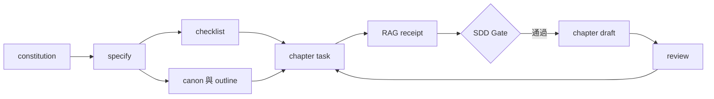

+++
title = '【AI工具】小說 Plugin v1 - 用規格驅動與本機 RAG 管理長篇創作'
date = '2026-09-06T10:00:00+08:00'
slug = 'novelist-plugin-v1-specification-driven-writing'
description = '介紹 Novelist Skills 的小說創作流程：以 SDD Gate、Canon、章節任務、本機 RAG 與連續性檢查，把長篇小說轉成可追蹤、可檢索、可審查的專案。'
categories = ['AI工具', '開發工具']
tags = ['GitHub Copilot', 'Plugin', 'AI-Skills', 'RAG', '小說創作', 'SDD']
keywords = ['Novelist Skills', '小說 Plugin', 'GitHub Copilot', 'Specification-Driven Development', '本機 RAG', '連續性檢查']
image = ''
+++

## 前言

長篇小說最容易失控的地方，通常不是單一段落寫得好不好，而是章節累積後的角色狀態、事件順序、伏筆與世界觀是否還能彼此對得起來。

`Novelist Skills` 是給 VS Code GitHub Copilot Agent 使用的小說創作 Plugin。這篇把它稱為「小說 Plugin v1」，指的是第一個可完整實作的創作流程；目前 `plugin.json` 的套件版本仍是 `0.7.0`。它的核心想法很直接：將規格驅動開發（Specification-Driven Development, SDD）放進小說創作，讓每一章都能被追蹤、檢索與審查。

---

## 一、Plugin 解決什麼問題？

單靠聊天上下文寫長篇故事，常會遇到幾個問題：

- 角色前一章死亡，後面卻沒有交代就重新出現。
- 已埋下的線索被遺忘，或不同章節對同一件事有矛盾描述。
- 想寫下一章時，得重新整理角色、設定、前情與目前進度。
- 草稿雖然寫完，卻沒有可回溯的「為什麼這一章可以成立」的依據。

Plugin 不把這些資訊放在聊天記憶裡，而是把它們存成可讀、可版本控制的檔案。每次寫作前都從已核准的資料取回必要脈絡，再決定能不能進入正文。

## 二、六個明確階段

Plugin 提供六個由使用者明確呼叫的命令：

```text
/novelist-skills:novelist-new-story
/novelist-skills:novelist-rule
/novelist-skills:novelist-plan
/novelist-skills:novelist-chapter
/novelist-skills:novelist-write
/novelist-skills:novelist-review
```

| 命令 | 工作 | 主要產物 |
| --- | --- | --- |
| `novelist-new-story` | 建立小說與治理準則 | `constitution.md`、語系設定 |
| `novelist-rule` | 訪談並確認故事規格 | `spec.md`、需求清單 |
| `novelist-plan` | 規劃角色、世界觀、伏筆與大綱 | `characters.json`、`canon/`、`outline/` |
| `novelist-chapter` | 定義單章任務並取回前情 | chapter task、RAG receipt |
| `novelist-write` | 通過 Gate 後產生章節草稿 | `chapters/drafts/*.md` |
| `novelist-review` | 審查章節並更新故事狀態 | summary、canon、progress |

每個命令都設定為 `disable-model-invocation: true`。意思是 Agent 不會看到一句「我想寫小說」就自行跨過步驟，而是由作者控制目前要進行的階段。

---

## 三、SDD Gate：先確認，再寫正文

創作流程中的 Gate 依賴關係如下：



每一份核准產物會記錄 SHA-256。當上游規格、canon 或大綱改變，下游核准就會失效，需要重新檢索或重新審查。這不會替作者判斷故事好不好，但能避免在過期設定上繼續擴寫。

執行正文寫入前的檢查範例：

```powershell
python shared/novelist/scripts/sdd.py gate novels/my-story --task chapters/tasks/01.md
```

Gate 沒有通過時，應回到缺少或過期的產物，而不是強行生成正文。

## 四、本機 RAG 如何幫助連載

檢索器掃描已核准的規格、canon、大綱、章節摘要以及高優先級狀態檔：

- `story.json`：故事名稱、內容語系、主角與最新進度。
- `characters.json`：角色個性、別名、位置、存亡與回歸條件。
- `progress.json`：已接受章節、摘要與角色歷史。

目前採用 BM25 類似排名，並支援 Latin word token 與 CJK bigram。這代表繁中小說不必接外部向量資料庫或 API，也能依照故事詞彙取回相關片段。

```powershell
python shared/novelist/scripts/retrieve.py novels/my-story "主角第一次見到戒指時知道什麼"
```

每次檢索會產生 receipt，綁定章節任務 hash、知識庫 hash 與內容語系。只要其中之一變更，就必須重新檢索，讓「寫作前讀了哪些資料」能被追溯。

## 五、角色連續性不是靠記憶

角色可以有 `active`、`departed`、`missing` 與 `dead` 等狀態。當非 `active` 的角色突然出現在草稿，連續性檢查會阻擋該章。

```powershell
python shared/novelist/scripts/check_continuity.py novels/my-story novels/my-story/chapters/drafts/01.md
python shared/novelist/scripts/validate_project.py novels/my-story
```

若角色需要回歸，流程要求在審查與接受階段分別提供明確理由。這讓劇情反轉仍可成立，但不會因為工具忘記上一章就破壞設定。

---

## 六、小說專案的檔案結構

一部作品以獨立目錄管理：

```text
novels/<story-slug>/
├── .novelist/
├── canon/
├── chapters/
│   ├── drafts/
│   ├── summaries/
│   └── tasks/
├── checklists/
├── outline/
├── constitution.md
├── spec.md
├── story.json
├── characters.json
└── progress.json
```

例如《賭徒》將故事規格、四名角色、三段玻璃橋的規則、單章草稿與最新進度分開保存。作者可以單獨檢視任一層，而不需要從一段很長的聊天紀錄尋找答案。

## 結論

小說 Plugin v1 的重點不是把創作變成死板的表單，而是把最需要被守住的內容變成可驗證的契約：規格、canon、章節任務、檢索結果與審查結論。

當故事越寫越長，能被版本控制、能重複檢查的結構，會比「希望模型記得」更可靠。下一步則是將核准可公開的章節放進小說庫，讓讀者能在 Blog 上閱讀。